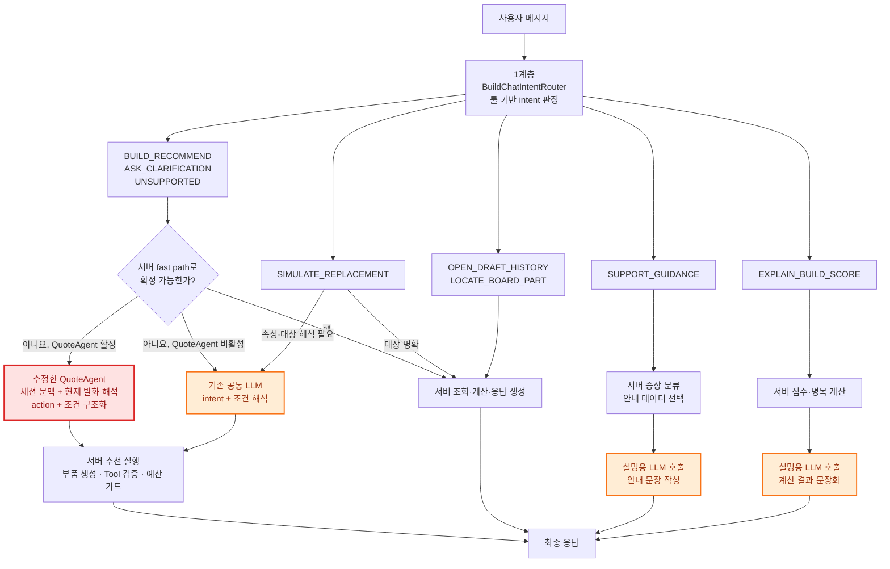

## 기능 재설계

*왜 재설계를 하려 하는가?*  
→ 현재 Ai Agent는 Rule Base로 작동하는 만큼,  
LLM에서 다양한 목적으로 채팅을 하여 결과를 도출하는 "유연성"이 상당히 부족함.  
"대화 모드"와 "행동 모드"로 분기하여, 챗봇 아키텍처를 재설계 하여 적용 진행 중.  
<br>  

**LLM 입출력 양식 수정본**  
<table>
<th>LLM이 "대화 모드"로 판단했을 경우를 가정:</th>
<th>반대로 "행동 모드"일 경우:</th>
</tr>
<tr>
<td>
<pre>{
  "conversationMode": true,
  "replyMessage": "생성된 응답 문장",
  "action": null,
  "contextPatch": {
    "budget": null,
    "usageTags": [],
  }
}</pre>
</td>
<td>
<pre>{
  "conversationMode": false,
  "replyMessage": null,
  "action": {
    "type": "FULL_BUILD_RECOMMEND",
    "ragQuery": { 4개의 속성 }
  },
  "contextPatch": 대화모드에서 쌓아논 것
}</pre>
</td>
</table>

contextPatch는 대화가 왕복되면서 누적됨 → 누적 요소 4개 이상 시: 행동모드로 전환  
<br>  

**Recommender System을 구축하자**  
초기 구현 방식: 각 부품마다 4개의 속성(백터) → 내적 연산으로 8개(각 카테고리 별) 뽑기  
"행동 모드" AI는: 사용자 context로 "비정형" 태그를 뽐는다.. 어떻게 정규화를 하나?  
비정형 태그를 4차원 백터로 투영하는 방식이 있다. 예시로:
```
고정된 4개 속성: [성능, 가성비, 작업성, 정숙성]

태그의 변환 방식: 
3D_MAX    → [0.8, 0.0, 1.0, 0.0]
그래픽작업 → [0.7, 0.0, 1.0, 0.0]
가성비    → [0.0, 1.0, 0.0, 0.0]

이를 통해 사용자 연산된 사용자 백터:
= ([0.8,0,1,0] + [0.7,0,1,0] + [0,1,0,0]) / 3
= [0.5, 0.33, 0.67, 0]
```
다만 **기술적 챌린지인 만큼 초기 구현에서는 제외하기로**  
그럼 어떻게?.. AI에게 4개 속성을 강제로 표현하기로  
<table>
    <th>초기 버전:</th>
    <th>고도화 버전:</th>
    </tr><tr>
    <td>
    <pre>AI 대화
→ 고정된 4개 선호 점수 출력
→ 부품의 4개 점수와 내적
→ 추천 결과 비교·검증</pre>
    </td>
    <td>
    <pre>비정형 태그 누적
→ 카테고리별 사용자 벡터 생성
→ 카테고리별 다차원 부품 벡터와 내적
→ 추천 결과 비교·검증</pre>
    </td>
</table>
<br>  

**구현 시작: 백터 스키마**  
초기 구현은 벡터를 공통 속성 2개(성능, 가성비)로 시작한다.  
각 식을 구성하는 방향은 다음과 같다:
```
성능점수 = (부품 benchmarkScore - 카테고리 최솟값) / (카테고리 최댓값 - 카테고리 최솟값)

가성비 원점수 = benchmarkScore / price
가성비점수 = (가성비 원점수 - 카테고리 최솟값) / (카테고리 최댓값 - 카테고리 최솟값)
```
<br>  

**후처리 검증 툴 greedy 알고리즘 적용**  
GPU가 검증에서 실패하였다고 가정할 경우.. 예시: 
``` 
GPU 1순위 선택:
→ 실패 Tool이 지목한 충돌 부품 확인
→ GPU 2순위 교체 비용 계산
→ 충돌 부품 교체 비용 계산
→ 비용이 낮은 경로 선택
→ 최대 2단계까지만 백트래킹
```
<br>

**기존 AI와 나의 튜닝 방향 요약**  
|구분|나의 방향|기존 방향|
|:---|:---|:---|
|LLM 역할|의도 분류/조건 구조화|맥락/선호도 추출|
|추천 방식|사용자별 선호 백터 내적|규칙/가격 중심 후보 생성|
|대화 상태|서버 세션에 누적|프론트가 이전 문맥 재전송|
|조합 생성|백터 내적 + 백트래킹|티어/예산/제약별 다양한 경로|
|검증|조합 과정에서 검증도구 호출|생성 후 검증 및 휴리스틱 수정|

<br>  

**세션 정책 수립**  
대화의 상태와 책임을 프론트 → 서버로 옮기기  
현재: 프론트가 세션ID + 문맥을 보관.. 서버로 매번 전송  
개선: 프론트는 메시지만 전송.. 서버가 세션 + 문맥 보관.. 버튼으로 "새 세션"이동 可  
.. 계정 하나 당 = 하나의 session을 가지도록 정책 수립 필요!  
<br>

**현재 Main과 병합된 Agent 기능 아키텍처 살펴보기**  

<br>

문제점 분석:  


대수술이 필요하다..  
1차: 기존 1계층(BuildChatService)를 붕 뜨게 한 다음 quoteagent를 붙인다.  
.. 임시로 1계층의 분기는 비활성화 된다.  

