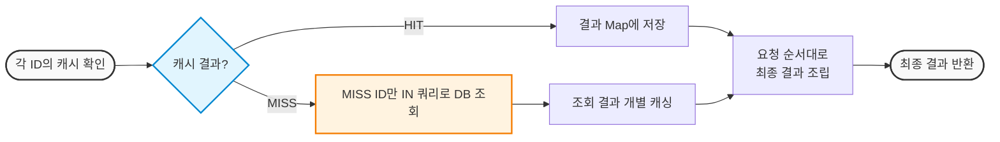

### Tool 기능 고도화하기

기존 로직(리펙토링 전):  
Agent 실행 흐름.. RAG로 부품/근거 검색 → Tool로 검증 → filtering 하여 전달  

필터링 흐름은 다음과 같다:  
compatibility FAIL → 추천 제외  
power FAIL → 추천 제외  
size FAIL → 추천 제외  
performance WARN → 제외 안 함  
price WARN/FAIL → 보통 경고/신뢰도 반영  
<br>

**퍼포먼스 tool 고도화**  
현재 출력 형태를 정리하자면..  
A. benchmark 있음 + PASS → status=PASS, score=1.0, confidence=HIGH  
B. benchmark 있음 + WARN → status=WARN, score=0.65, confidence=HIGH  
C. benchmark 없음 + PASS → status=PASS, score=1.0, confidence=MEDIUM  
D. benchmark 없음 + WARN → status=WARN, score=0.65, confidence=MEDIUM  
  
WARN & PASS 기준..  
有: cpu >= 60 && gpu >= 70   
無: vRam >= 12GB  

비교적 단조롭다.. Rule의 복잡도?를 높이는 것은 우선순위 미루기로  
<br> 

**캐시 관심사 나누기**  
A계층: Spring 내 Caffeine 힙 메모리 → DB에 접속하여 가져온 데이터 캐싱  
B계층: Redis 사용 → 가져온 데이터로 Spring에서 연산한 결과를 캐싱  
E계층: ? DB(Postgre)  

트래픽 발생 지점 예상하기:  
셀프 견적: 사용자가 UI로 "견적질"을 하면서 매번 선택된 부품, 선택가능 부품 검증 호출됨  
챗봇 질의: 사용자가 챗봇으로 물어볼 때, 단발성의 최대 3개의 견적 검증로직 호출됨  
<br>  

## 캐시 적용하기
Caffine 내부에 저장 방식을 표현하자면.. 다음과 같다:  
```
cacheName → Caffeine Cache
key → String
value → Map<String, Object>
```
코드 전반 리펙토링 수행.. Service 내 Query 함수: 새 파일로 이동 및 helper 함수 빼놈  
해당 함수는 사실상 Repository.. id 기반 DB의 raw 데이터 저장 목적  
<br>

**DB Parts 호출: 트래픽 시나리오 구성하기**  
self-quote(셀프 견적):  
검증 tool은 총 5가지, 단계는 총 8가지.. 만약 부품이 각 단계별 10개라면?  

현재 로직 상: 
(맨 앞 제외) 7개 슬롯 × ( 10개.. 5가지 tool) + 그래프 검증.. 8번 × 5가지 tool  
= 350 + 40 = 390번 탐색.. 사실상 완전탐색을 매번 수행!  

시나리오 흐름은 다음과 같다:  

슬롯 하나: getParts(부품 리스트) → addPart(부품 선택) → checkAllCoditions(모두 검증)  
.. 슬롯 × 8번 반복 = 유저의 "견적 뽑기" 1회성 행동  
.. 견적 뽑기(1회) ⇒ 트래픽 시나리오에서 증폭 가능  

여기서!  
getParts: DB에서 부품 list 가져오기 → 부품 하나 씩 **Tool로 검증**하기.. 2번 DB 조회  
addPart: 사용자 슬롯에 특정 부품 저장 수행.. Tool 검증 없음  
checkAllConditions: 8개의 슬롯을 대상으로 5개의 **Tool 검증**을 수행  
.. 따라서, 두 곳에서만 캐싱 전략 수립 한정할 것. 
<br>

**DB Parts 호출: 흐름이해 및 작성하기**  
getParts.. 은, 쉽게 도식화 하면 다음과 같다(예):    
``` 
draftId 조회 → 이미 선택한 부품만 가져옴. 예: CPU

후보 목록 조회 → partRows(search)에서 가져옴. 예: 메인보드 A/B/C

checkBuild → CPU + 메인보드 A
           → CPU + 메인보드 B
           → CPU + 메인보드 C
```
기존: draftId → query로 Part객체 리스트 형태로 한꺼번에 가져옴  
변경: draftId → partId 리스트 가져옴 → Part 객체 가져옴(캐싱 적용)  
<br>  

**+ 메인페이지 시나리오 추가 구성하기**  
복합 시나리오 구성은 다음고 같다:  
```
메인 부품 탐색 100%
├─ 70% 탐색 후 이탈
└─ 30% 셀프 견적 시작
```
<br>

## N + 1 문제 해결하기



