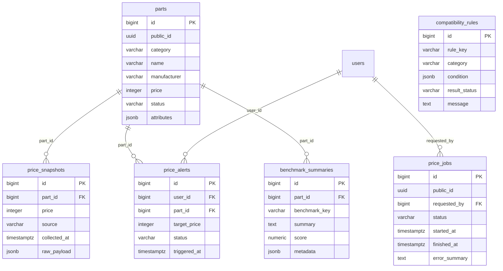

**기본 골격 구현 사항**  
```
http://localhost:5173/requirements
http://localhost:5173/builds/result
http://localhost:5173/builds/change-part
http://localhost:5173/my-quotes
http://localhost:5173/parts
http://localhost:5173/support
http://localhost:5173/support/tickets/sample
http://localhost:5173/login
http://localhost:5173/signup
``` 
<br>  

**테이블 관계 파악하기: 스키마**  

<br>

**검증 Tool 엔진**  
| 항목 | 직접 구현 가치 |
| :--- | :--- |
| 소켓 호환성 검사 | CPU socket ↔ Motherboard socket |
| RAM 규격 검사 | DDR4/DDR5 호환 |
| GPU 길이 검사 | GPU length ↔ Case max GPU length |
| PSU 전력 검사 | CPU/GPU 소비전력 + 여유율 |
| PASS/WARN/FAIL 판정 | 룰 기반 결과 생성 |
| evidence 생성 | 어떤 룰로 판단했는지 반환 |

<br>  

**소켓 호환성 검사**  

