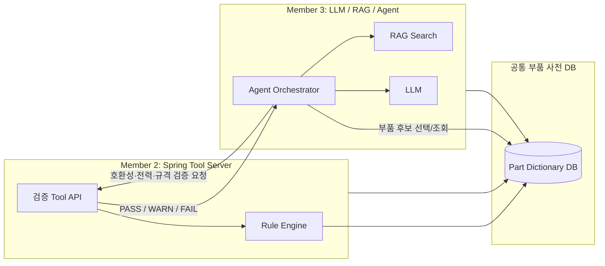
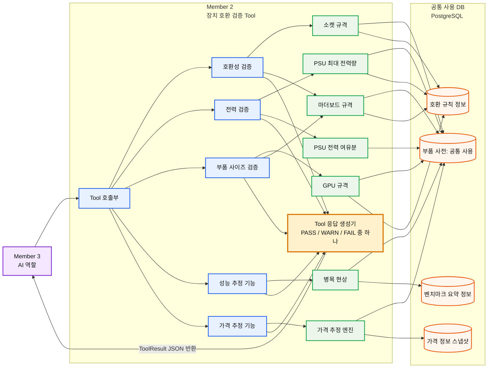

**이 플랫폼은 대략 어떤 서비스가 있나?**   

PC 추천 서비스:  
사용자 입력 → (AI를 통해) 견적 만들어주기  
.. 부가_1: 부품 호환성 검증  
.. 부가_2: 부품 변경 비교  

가격 확인 & 목표가 설정:  
쇼핑API로 가격 확인 등 수행 → 특정 부품 목표가 → 도달 시 알림 발송  

AS 서비스:  
PC Agent(설치 프로그램)이 로그 수집 → (사용자 동의 하) 로그 전송 & AS 티켓 생성  

관리자 페이지:  
추천 과정, Tool 호출 과정, RAG, AS 로그 등 확인 가능  
<br>  

**내가 담당한 2번은?**  
서비스 흐름을 보자:  
```
사용자 자연어 입력
↓
LLM이 요구사항 파싱 → 추천 견척 후보 생성  
↓
(2번 역할) 부품 간: 호환성, 전력 소비, 규격, 성능, 가격 검사  
↓
LLM이 해당 결과를 설명문으로 생성
↓
프론트에 추천 견적 표시  
```
<br>

**부품 데이터 모델링 개요**
|CPU|메인보드|GPU|케이스|파워|
|:---|:---|:---|:---|:---|
|소켓<br>세대<br>TDP<br>성능등급|CPU 소켓<br>칩셋<br>RAM 소켓 수<br>폼펙터<br>M.2/PCIe|길이<br>소비전력<br>권장 전력<br>성능등급|메인보드 규격<br>GPU 규격|커넥터 정보<br>출력 규격|

요청 JSON 형식:  
cpuId / motherboardId / ramIds: [ ] / gpuId / psuId / caseId / coolerId / storageIds: [ ]  

**공통**응답 JSON 형식:  
```
status: PASS | WARN | FAIL
score: 점수 산출(0~1사이 점수)
confidence: LOW | MEDIUM | HIGH
summary: 설명문
warnings: [ sourceId: 아이디, summary: 설명문 ]
evidence: [ sourceId: 아이디, summary: 설명문 ]
```
이는 룰 베이스 형태로, LLM이 사용되지 않는다.  
정확히는, LLM이 추천 견적을 생성하는데 사용하는 Tool이기 때문.  
<br>  
  
**아키텍처(LLM, 검증 Tool, 공통 리소스 DB) 구성**  

<br> 

**국부 아키텍처(검증 Tool - 접근 DB) 구성**  
