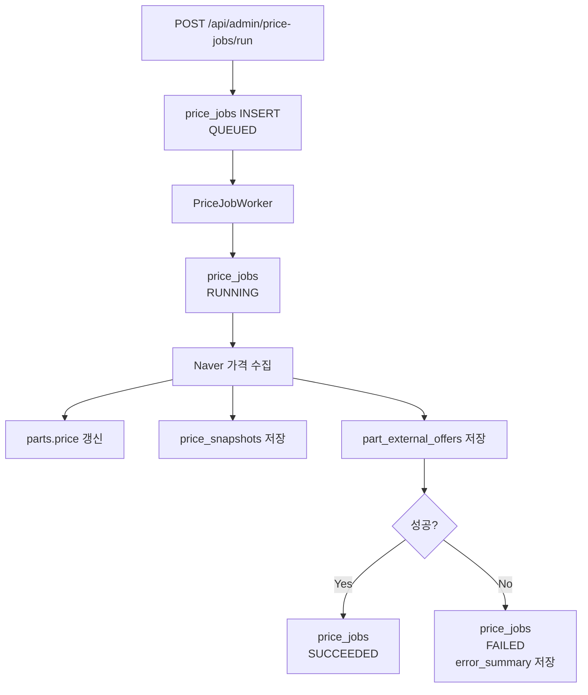
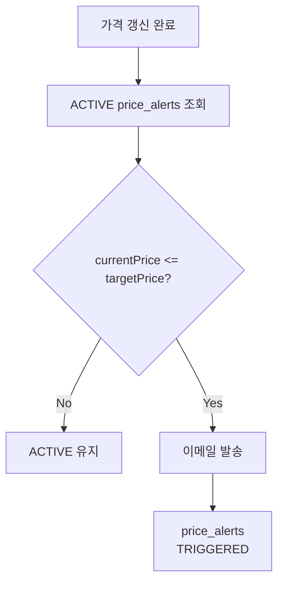
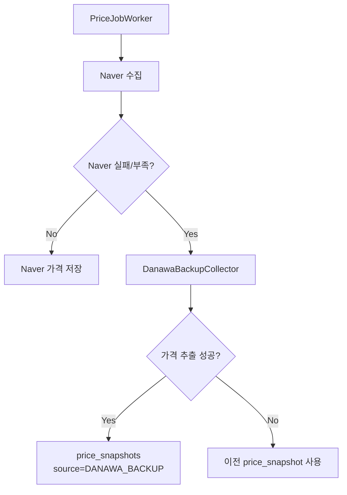
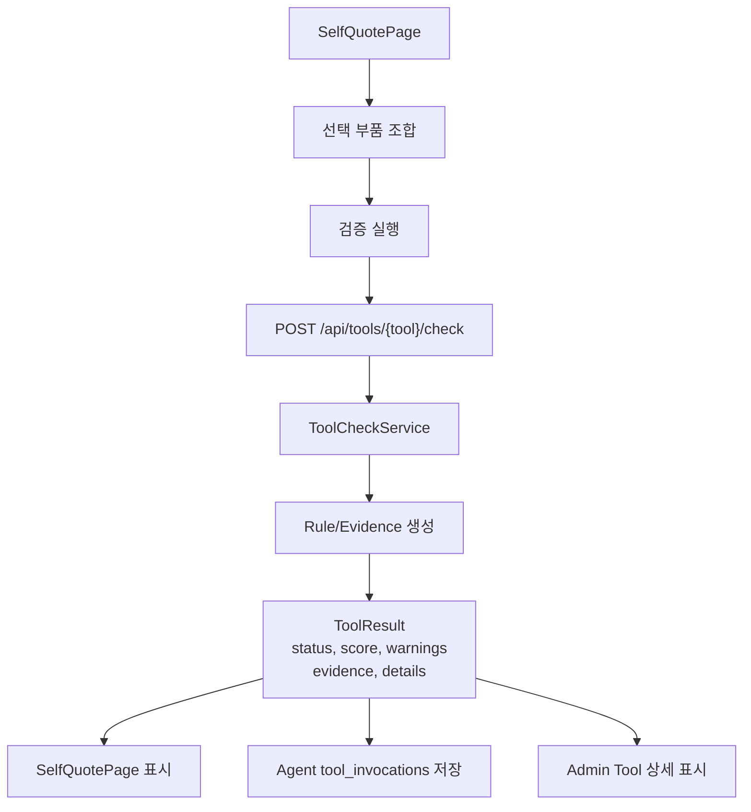

### 2번을 중심으로 한, 국부기능 정리  

**Price Job Worker**  

```mermaid
flowchart TD
  A[POST /api/admin/price-jobs/run] --> B[price_jobs INSERT<br/>QUEUED]
  B --> C[PriceJobWorker]
  C --> D[price_jobs<br/>RUNNING]
  D --> E[Naver 가격 수집]
  E --> F[parts.price 갱신]
  E --> G[price_snapshots 저장]
  E --> H[part_external_offers 저장]
  H --> I{성공?}
  I -->|Yes| J[price_jobs<br/>SUCCEEDED]
  I -->|No| K[price_jobs<br/>FAILED<br/>error_summary 저장]
```
   
  
**Price Alert 이메일/상태 전환**

```mermaid
flowchart TD
  A[가격 갱신 완료] --> B[ACTIVE price_alerts 조회]
  B --> C{currentPrice <= targetPrice?}
  C -->|No| D[ACTIVE 유지]
  C -->|Yes| E[이메일 발송]
  E --> F[price_alerts<br/>TRIGGERED]
```
   

**다나와 보완 수집**  

```mermaid
flowchart TD
  A[PriceJobWorker] --> B[Naver 수집]
  B --> C{Naver 실패/부족?}
  C -->|No| D[Naver 가격 저장]
  C -->|Yes| E[DanawaBackupCollector]
  E --> F{가격 추출 성공?}
  F -->|Yes| G[price_snapshots<br/>source=DANAWA_BACKUP]
  F -->|No| H[이전 price_snapshot 사용]
```
 

**Tool 근거 구조 + 직접 검증 UI**

```mermaid
flowchart TD
  A["SelfQuotePage"] --> B["선택 부품 조합"]
  B --> C["검증 실행"]
  C --> D["POST /api/tools/{tool}/check"]
  D --> E["ToolCheckService"]
  E --> F["Rule/Evidence 생성"]
  F --> G["ToolResult<br>status, score, warnings<br>evidence, details"]
  G --> H["SelfQuotePage 표시"]
  G --> I["Agent tool_invocations 저장"]
  G --> J["Admin Tool 상세 표시"]
```