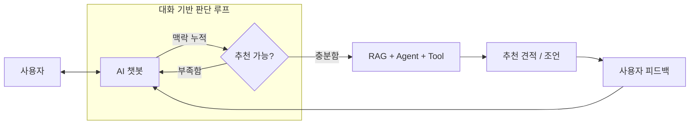

**기능 흐름 정리**  

 
  
### Tool 호출 함수 정리  
**Power Check:** `/api/tools/power/check`  
비교적 단조로운 산술 연산 로직.  
인풋: CPU_id → tdpW, GPU_id → wattage, PSU_id → capacityW.. 모두 DB내 parts_id 이다.  
→ 이를 통해 "데이터 정규화" 수행  

연산: 
예상전력 = CPU + GPU + 기타부품 + 기본 60W  
여유전력 = PSU 용량 - 예상전력
부하율 = 예상전력 / PSU 용량  

결과 도출: 
PASS.. PSU 용량 >= max(GPU 권장 전력, 예상전력 + 120W) && PSU 부하율 <= 85%  
WARN.. PSU 용량 >= 예상전력 && 여유 전력 >= 80W  
FAIL.. 둘 다 만족하지 못함  

집합관계:  
PASS = P  
WARN = W - P  
FAIL = 전체 - W  
→ "판정 기준 정규화"를 의미  
 

**Compatibility Check:** `/api/tools/compatibility/check`  
Power 보다 더 단조로운 규칙.  
인풋: CPU 소켓, MotherBoard 소켓  

결과 도출: 
PASS.. CPU socket == MotherBoard socket  
else.. FAIL  

집합관계:  
PASS = P  
FAIL = 전체 - P  
 

**아주 단조로운 규칙들: size, price**  
size 식: gpu_length <= max_gpu_length && coolerHeight <= max_cooler_height  
→ 둘 다 True 일 경우.. PASS, 그 외엔 FAIL  

price 식: total <= budget  
→ 예산 이내.. PASS, 초과 시: 8% 이내.. WARN, 그 외.. FAIL   
 

**Performace Check:** `/api/tools/performance/check`  
인풋: 장치(CPU, GPU) + Context()  

연산:  
둘 중 하나라도 벤치 마크가 있으면? => 이를 기준으로,  
벤치마크 있는 것을 기준으로 =>  cpu >= 60, gpu >= 70  
아얘 없으면 => GPU VRAM >= 12GB  

집합관계는 비교적 단순하다.  
주의! → 사용자가 원하는 적정 스팩(배그 144FPS) 등을 기준으로 재구성 필요성이 있음.  
.. 이는 추후에 직접 구현하기로 
주의! → 종합 호출하는 로직은 있으나, 종합 결과는 내놓지 않고 agent가 판단.  
.. 통상적으로 spring 측에서 판단할 필요가 있다고: 구현 필요   
   

### AI 호출 흐름 정리  
현재 ai 서비스는 3가지이다: chat(사용자와 대화), rag(장비 검색), tool(장비 검증)  
주의! → 현재는 매 대화마다 chat.. rag.. 로 장비 검색을 함  
.. 이는 추후에 맥락 쌓고 장비 추천으로 trigger 되도록 구현 필요  
.. 따라서, "대화 상태", "행동 상태"로 분류할 필요가 있음  
.. 대화 맥락 누적 기능이 부재한 상황(대화 상태에서 적용 필요)   
  

**이해 & 수정**  
`AiChatRequestDto`: 
사용자가 요소 선택을 맡겨, ai가 분류할 작업을 외주화 하고 있음.  
다음과 같이 수정 → message(본 내용: Ai가 해석 담당), sessionId(해당 방 맥락 추적)  

`respondLlmRequired`: 오케스트레이션 함수  
request(message + sessionId) → Rag 검색(뭘?) → llm 호출 → 룰 베이스 분기 → 출력  
.. Rag: Response 포장용으로 사용 ~ 비효율 적이므로 삭제  
 

**LLM 입출력 양식 구상**  
<table>
<th>LLM이 "대화 모드"로 판단했을 경우를 가정:</th>
<th>반대로 "행동 모드"일 경우:</th>
</tr>
<tr>
<td>
<pre><code>{
  "conversationMode": true,
  "replyMessage": "생성된 응답 문장",
  "action": null,
  "contextPatch": {
    "budget": null,
    "usageTags": [],
    "missingSlots": ["budget", "usage"]
  }
}</code></pre>
</td>
<td>
<pre><code>{
  "conversationMode": false,
  "replyMessage": null,
  "action": {
    "type": "FULL_BUILD_RECOMMEND",
    "ragQuery": { 세부 항목들 }
  },
  "contextPatch": null
}</code></pre>
</td>
</table>

인풋은 기본적으로: { message: 받아온 raw_text, contextState: Spring에서 조회한 맥락 }.. 으로 설정  
   

****
