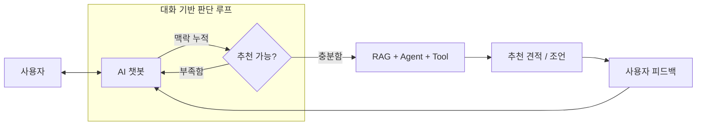

**기능 흐름 정리**  

 
  
### Tool 호출 함수 정리  
**Power Check:** `/api/tools/power/check`  
비교적 단조로운 산술 연산 로직.  
인풋: CPU_id → tdpW, GPU_id → wattage, PSU_id → capacityW.. 모두 DB내 parts_id 이다.  

연산: 
예상전력 = CPU + GPU + 기타부품 + 기본 60W  
여유전력 = PSU 용량 - 예상전력
부하율 = 예상전력 / PSU 용량  

결과 도출: 
PASS.. PSU 용량 >= max(GPU 권장 전력, 예상전력 + 120W) && PSU 부하율 <= 85%  
WARN.. PSU 용량 >= 예상전력 && 여유 전력 >= 80W  
FAIL.. 둘 다 만족하지 못함  

집합관계:  
PASS = P  
WARN = W - P  
FAIL = 전체 - W  

