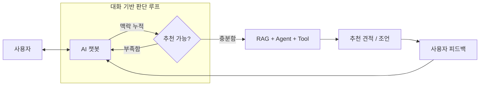

**기능 흐름 정리**  

 
  
### Tool 호출 함수 정리  
**Power Check:** `/api/tools/power/check`  
비교적 단조로운 산술 연산 로직.  
인풋: CPU_id → tdpW, GPU_id → wattage, PSU_id → capacityW.. 모두 DB내 parts_id 이다.  
→ 이를 통해 "데이터 정규화" 수행  

연산: 
예상전력 = CPU + GPU + 기타부품 + 기본 60W  
여유전력 = PSU 용량 - 예상전력
부하율 = 예상전력 / PSU 용량  

결과 도출: 
PASS.. PSU 용량 >= max(GPU 권장 전력, 예상전력 + 120W) && PSU 부하율 <= 85%  
WARN.. PSU 용량 >= 예상전력 && 여유 전력 >= 80W  
FAIL.. 둘 다 만족하지 못함  

집합관계:  
PASS = P  
WARN = W - P  
FAIL = 전체 - W  
→ "판정 기준 정규화"를 의미  
 

**Compatibility Check:** `/api/tools/compatibility/check`  
Power 보다 더 단조로운 규칙.  
인풋: CPU 소켓, MotherBoard 소켓  

결과 도출: 
PASS.. CPU socket == MotherBoard socket  
else.. FAIL  

집합관계:  
PASS = P  
FAIL = 전체 - P  
 

**아주 단조로운 규칙들: size, price**  
size 식: gpu_length <= max_gpu_length && coolerHeight <= max_cooler_height  
→ 둘 다 True 일 경우.. PASS, 그 외엔 FAIL  

price 식: total <= budget  
→ 예산 이내.. PASS, 초과 시: 8% 이내.. WARN, 그 외.. FAIL   
 

**Performace Check:** `/api/tools/performance/check`  
인풋: 장치(CPU, GPU) + Context()  

연산:  
둘 중 하나라도 벤치 마크가 있으면? => 이를 기준으로,  
벤치마크 있는 것을 기준으로 =>  cpu >= 60, gpu >= 70  
아얘 없으면 => GPU VRAM >= 12GB  

집합관계는 비교적 단순하다.  
주의! → 사용자가 원하는 적정 스팩(배그 144FPS) 등을 기준으로 재구성 필요성이 있음.  
.. 이는 추후에 직접 구현하기로  
   

### AI 호출 흐름 정리  

